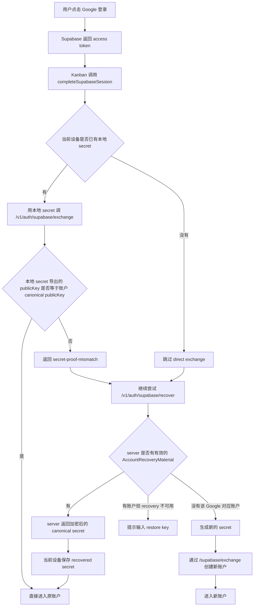
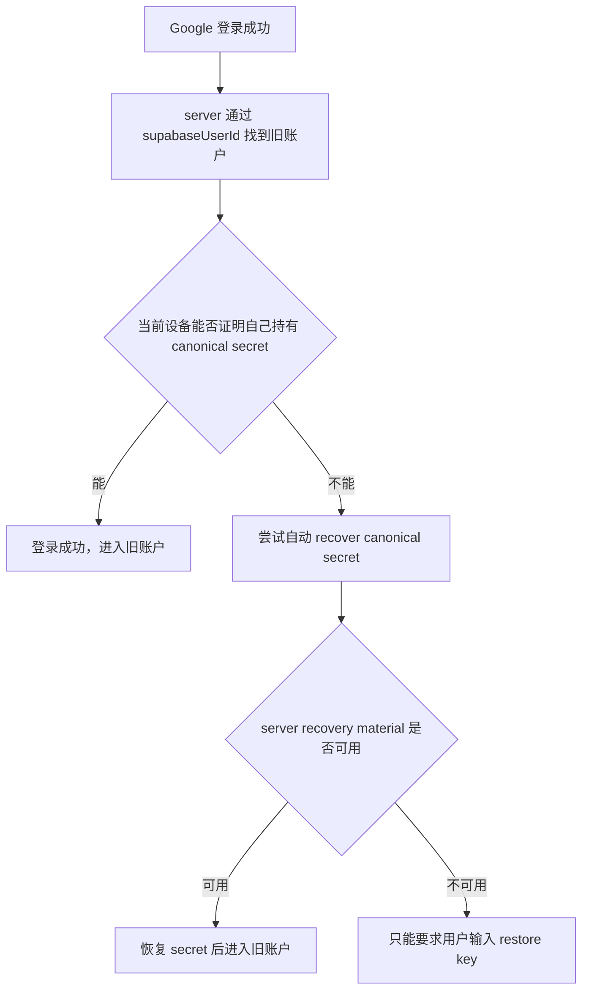
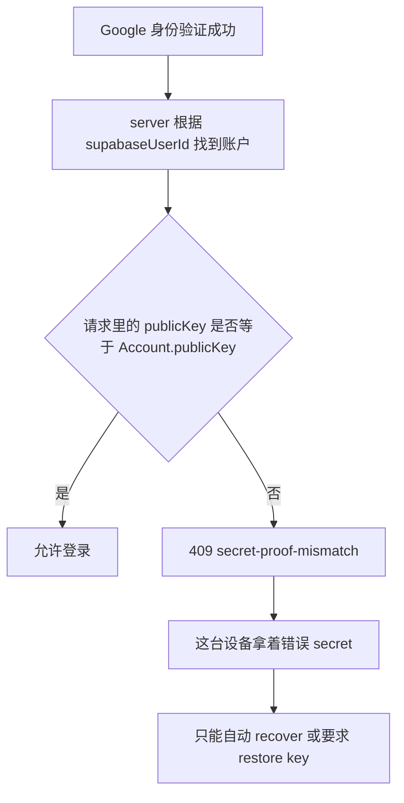
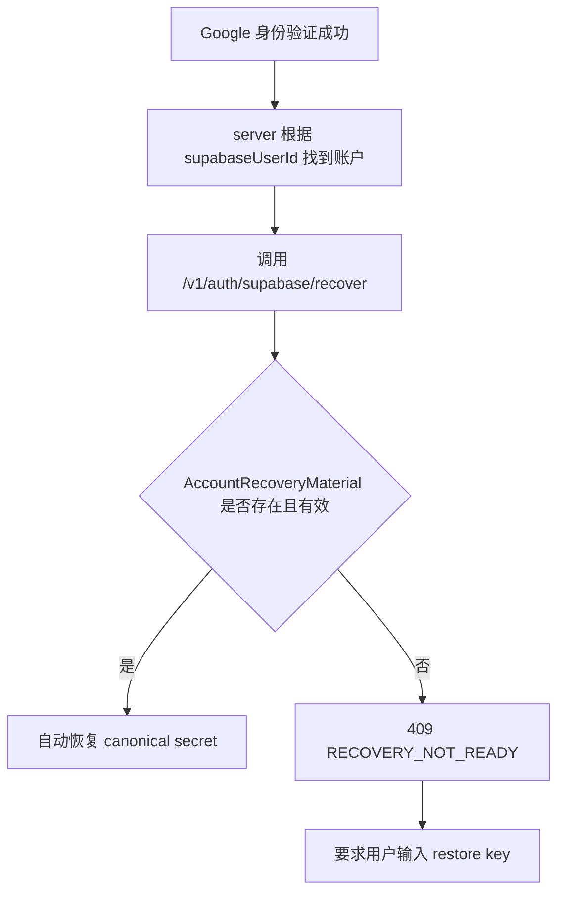
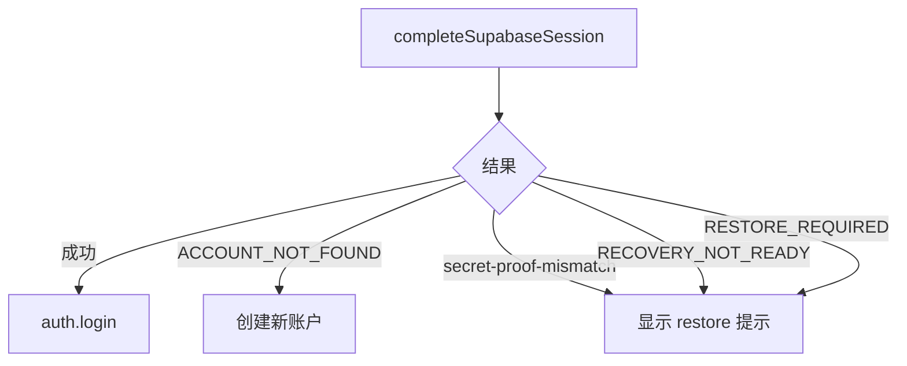
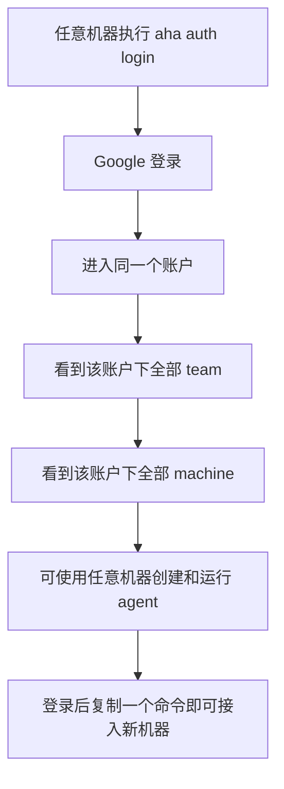
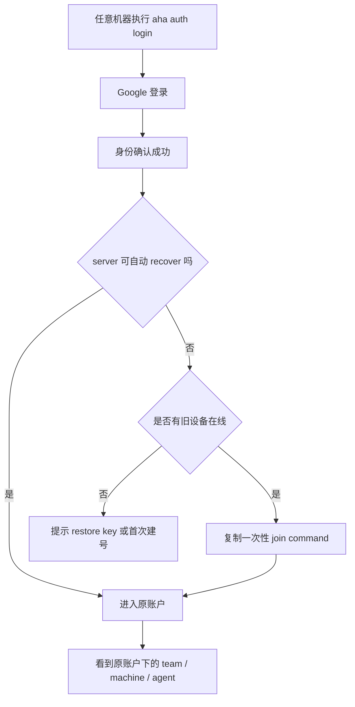
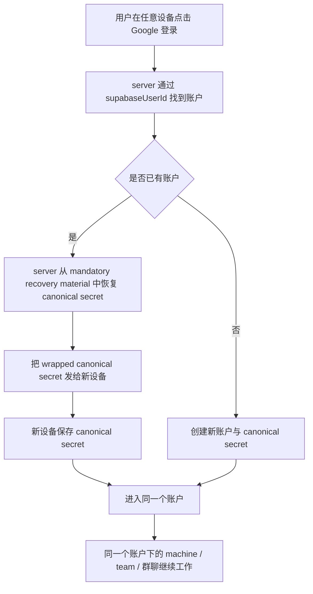

# 认证登录完整路径

> 状态：基于 2026-04-01 当前代码路径整理  
> 范围：`aha-cli`、`kanban`、`happy-server`、Google / Supabase 登录与 restore / recover 路径

> 2026-04-01 `online-v2-fix` 更新：
> 已新增一次性 `join ticket` 接入链路，并把 CLI Email OTP 改为 `recover-first`。
> 本文同时保留“修复前为什么会卡在 restore key”的背景分析，以及“修复后真实用户旅程”。
>
> 2026-04-02 补充：
> CLI 在 `restore / reconnect / join` 成功后，也需要自动把 canonical secret bootstrap 回 `/v1/account/recovery-material`。
> 否则会出现 “CLI 已恢复成功，但新浏览器 Google 登录仍卡在 Restore Key” 的割裂体验。

## 文档目标

这份文档只做一件事：

- 把当前“登录、恢复、换设备、群聊连续性”的完整真实路径梳理清楚
- 全部用中文说明
- 说明为什么会出现“Google 登录成功后还提示输入 restore key”
- 明确哪些路径当前能保证进入同一个账户，哪些不能

目标产品语义是：

> 同一个 Google，不论在哪台机器、哪个浏览器登录，都应该进入同一个账户，并继续同一个群聊 / team / machine 体系。

`online-v2-fix` 已经把主路径收敛到更接近这个目标的状态，但还没有把“只靠 Google、完全不需要任何恢复材料”做到绝对成立。

## 一句话结论

现在系统里：

- `Google / Supabase` 解决的是“你是谁”
- `contentSecretKey / publicKey` 解决的是“你进入哪个 Aha 账户”

修复前会出现下面这种情况；修复后，这个问题优先走自动 recover，其次走一次性 join command，最后才退回 restore key：

- Google 登录已经成功
- server 也已经知道这是哪个 Google
- 但当前设备拿不到这个账户的 canonical secret

这时 UI 就会退回到：

> 请输入 restore key

所以这不是“Google 没登录成功”，而是：

> 身份登录成功了，但账户密钥恢复失败了

## 本轮经验教训

- `Account.publicKey` 是账户根身份，不是某台设备的公钥。
- `join ticket` 是“加设备”能力，不是“同一 Google 自动恢复”的替代品。
- Web `localStorage` 里保留 secret 是一致性要求，不是偶然实现。
- 只要某条成功恢复路径没有把 recovery material 反向补回服务端，后续 fresh browser Google 登录就仍然会掉进 `Restore Key`。

## 核心对象

### 1. Supabase / Google 身份

表示“这个人是谁”。

### 2. `Account.supabaseUserId`

表示“这个 Google / Email 登录身份绑定到了哪个账户”。

### 3. `Account.publicKey`

这是 server 侧真正的账户根身份。

### 4. `contentSecretKey`

这是客户端真正持有的账户根密钥，它会导出 `publicKey`。

### 5. `restore key`

它不是 token，不是 session，不是短期验证码。

它本质上是：

> canonical `contentSecretKey` 的可人工输入表示

如果同一个真实账户在不同设备上出现了两个不同的 restore key，通常说明不是“正常刷新”，而是已经发生了身份分叉。

### 6. `machineId`

这是某一台 CLI 机器在某个账户下的机器标识。

它不是账户身份，它只是账户下的一台机器。

## 当前系统真正的账户判定方式

当前真实逻辑不是：

```text
Google -> 账户
```

而是：

```text
contentSecretKey -> publicKey -> Account
Google -> supabaseUserId -> 找到账户候选
```

所以“同一个 Google”现在还不是完整硬保证。

## `online-v2-fix` 后的完整主路径

```mermaid
flowchart TD
    A[用户点击 Google 登录] --> B[Supabase 返回 access token]
    B --> C[Kanban / CLI 调用 recover-first]

    C --> D{server 是否已有该 Google 对应账户}
    D -- 没有 --> E[客户端生成新 secret]
    E --> F[/v1/auth/supabase/exchange 创建新账户]
    F --> G[进入新账户]

    D -- 有 --> H{server recovery material 是否就绪}
    H -- 是 --> I[/v1/auth/supabase/recover 返回 canonical secret]
    I --> J[当前设备保存 canonical secret]
    J --> K[进入原账户]

    H -- 否 --> L{用户是否已有旧设备在线}
    L -- 是 --> M[旧设备生成 join ticket]
    M --> N[npx aha auth login --code aha_join_xxx]
    N --> O[/v1/auth/account/join 返回 canonical secret]
    O --> K

    L -- 否 --> P[回退到 restore key 灾备]
```

这条链路的真实优先级现在是：

1. 自动 recover canonical secret
2. 用旧设备复制一条一次性 join command
3. 最后才用 restore key

## 修复前的完整主路径



## 为什么登录后还提示 restore key

完整原因链是：



所以“登录后还要 restore key”的根因不是登录失败，而是：

- 当前设备没有 canonical secret
- 且 server 不能自动把 canonical secret 发回来

## 两条最关键的失败分支

### 分支 A：`secret-proof-mismatch`

含义：

- 这个 Google 已经绑定了一个既有 Aha 账户
- 这个设备当前拿着的 secret 不是那个账户的 canonical secret
- server 拒绝把错误 secret 覆盖成 canonical identity

逻辑图：



用户语义：

> 你这个 Google 是对的，但这台设备上的账户密钥不对。

### 分支 B：`RECOVERY_NOT_READY`

含义：

- server 已经知道这个 Google 对应哪个账户
- 但 server 还没有有效的 `AccountRecoveryMaterial`
- 所以没法把 canonical secret 自动发给新设备

逻辑图：



用户语义：

> 我们知道你是谁，也知道你的旧账户在哪，但现在还拿不回那个账户的密钥。

## 为什么当前 UI 让人感觉逻辑错了

因为前端现在把这几种错误都合并成了同一种“需要 restore”：

- `SupabaseRestoreRequiredError`
- `SupabaseSecretMismatchError`
- `SupabaseRecoveryNotReadyError`

也就是：



因此用户看到的是：

- 我明明已经 Google 登录了
- 结果系统还要我输入 restore key

这在用户心智里当然不合理，因为用户期望的是：

```text
同一个 Google = 同一个账户
```

但当前系统实际仍然是：

```text
同一个 Google = 找到候选账户
能不能进入这个账户，还要看 canonical secret 能不能恢复
```

## 当前所有主要用户旅程

### W1. 第一次在全新浏览器里用 Google 登录

- 起点：这个 Google 之前从没创建过 Aha 账户
- 路径：`recover` 返回 `ACCOUNT_NOT_FOUND`，客户端生成新 secret，`exchange` 创建新账户
- 结果：创建新账户
- restore key：生成新的 canonical restore key
- 群聊连续性：还不存在旧群聊，不涉及
- 当前是否成立：成立

### W2. 同一个浏览器退出后再次用同一个 Google 登录

- 起点：浏览器 localStorage 里仍然保留着 canonical secret
- 路径：直接带旧 secret 去 `exchange`
- 结果：进入原账户
- restore key：不变
- 群聊连续性：保留
- 当前是否成立：成立，但只在同一个浏览器 profile 内成立

### W3. 同一个浏览器 token 失效，但 secret 还在

- 起点：session 过期，但 `AUTH_SECRET_REAUTH_KEY` 还在
- 路径：重新 `exchange`
- 结果：进入原账户
- restore key：不变
- 群聊连续性：保留
- 当前是否成立：成立

### W4. 新浏览器 / 新设备，同一个 Google，server recovery 已就绪

- 起点：当前设备没有 secret，但 server 有有效 recovery material
- 路径：`recover` 成功拿回 canonical secret
- 结果：自动进入原账户
- restore key：与老设备相同
- 群聊连续性：保留
- 当前是否成立：成立，但前提是 recovery material 已存在

### W5. 新浏览器 / 新设备，同一个 Google，但 recovery 未就绪

- 起点：当前设备没有 secret，server 也拿不出 canonical secret
- 路径：`recover` 返回 `RECOVERY_NOT_READY`，此时优先改走旧设备生成的一次性 join command
- 结果：
  - 如果旧设备在线：可以继续并入原账户
  - 如果旧设备不在线：才退回手工 restore key
- restore key：不再是唯一办法，但仍是最终灾备
- 群聊连续性：有旧设备在线时可保留；否则在手工 restore 前中断
- 当前是否成立：部分成立

这是当前离产品目标最近、也是最核心的问题。

### W6. 当前设备持有错误 secret，再去用同一个 Google 登录

- 起点：当前设备 secret 与 canonical secret 不一致
- 路径：`exchange` 命中 `secret-proof-mismatch`
- 结果：如果 server 能 recover，则还能收敛回旧账户；否则只能手输 restore key
- restore key：错误 restore key 不能变成 canonical
- 群聊连续性：只有恢复成功后才能保留
- 当前是否成立：有条件成立

### W7. 已登录设备主动点击“链接新设备”

- 起点：当前设备已经在正确账户里
- 路径：页面优先展示一次性 join command，同时保留 restore command / QR / 手动 URL / restore key
- 推荐命令：

```bash
npm i aha-agi && npx aha auth login --code aha_join_xxxxxxxxxxxxxxxxxxxxxxxx
```

- 备份命令：

```bash
npm i aha-agi && npx aha auth restore --code XXXXX-XXXXX-XXXXX-XXXXX
```

- 结果：新设备能以更低阻力显式加入同一个账户
- restore key：不变
- 群聊连续性：保留
- 当前是否成立：成立

### C1. CLI 已经认证，再执行 `npx aha auth login`

- 起点：本地已有 credentials
- 路径：CLI 直接判断 `Already authenticated`，然后尝试确保 daemon 运行；如果发现 `stopped state + orphan lock`，会先自愈清理
- 结果：仍然是同一个账户
- restore key：不变
- 群聊连续性：保留
- 当前是否成立：成立

### C2. 干净机器执行 `npx aha auth login`，通过浏览器批准

- 起点：CLI 本地没有 credentials
- 路径：CLI 发 terminal auth request，浏览器进入 `terminal/connect`，由浏览器端把 canonical secret 加密回传给 CLI
- 结果：CLI 加入浏览器当前所在的那个账户
- restore key：与浏览器当前账户相同
- 群聊连续性：保留
- 当前是否成立：成立，前提是浏览器本身已经在正确账户里

### C3. CLI 执行 `npx aha auth reconnect`

- 起点：本地已有 canonical secret
- 路径：用已有 secret 刷新 token
- 结果：进入原账户
- restore key：不变
- 群聊连续性：保留
- 当前是否成立：成立

### C4. CLI 执行 `npx aha auth restore --code ...`

- 起点：用户手上有 canonical restore key
- 路径：CLI 解析 restore code，恢复 secret，清理旧 machineId，重新注册 machine，启动 daemon
- 结果：显式恢复到原账户
- restore key：不变
- 群聊连续性：保留
- 当前是否成立：成立

这是当前最强、最稳的账户恢复路径。

### C5. CLI 执行 `npx aha auth login --email`

- 起点：用户走 email OTP，而不是浏览器 Google
- 路径：CLI 先拿 Supabase token，然后优先调用 `/v1/auth/supabase/recover`
- 结果：
  - 如果该身份之前没有账户：创建新账户
  - 如果该身份之前已有账户且 recovery 就绪：自动 recover 回旧账户
  - 如果该身份之前已有账户但 recovery 未就绪：提示用户使用旧设备的一次性 join command 或 restore key
- restore key：如果 recover 到旧账户，则不变；只有首次建号时才生成新的
- 群聊连续性：旧账户 recover / join 成功时保留
- 当前是否成立：对“自动回旧账户”部分成立

### C6. CLI 执行 `npx aha auth login --force`

- 起点：用户显式要求新身份或强制重建
- 路径：清空本地 credentials 和 machineId，再重新打开认证流程
- 结果：可能创建新身份，也可能切到另一个身份
- restore key：可能变化
- 群聊连续性：不保证
- 当前是否成立：这是故意破坏连续性的路径，不应该拿它要求 continuity

### C7. CLI 执行 `npx aha auth login --code ...`

- 起点：用户已有 restore code，或已有一次性 join ticket
- 路径：
  - 如果是 restore code：转发到 `auth restore --code`
  - 如果是 `aha_join_...`：转发到 `auth join --ticket ...`
- 结果：都可以并入同一个账户
- restore key：restore 路径不变；join ticket 是一次性的，不等于 restore key
- 群聊连续性：保留
- 当前是否成立：成立

## 群聊 / Team 连续性到底由什么决定

群聊和 team 连续性不由 Google 单独决定，而由下面三件事共同决定：

1. 当前设备最终拿到的是不是 canonical `contentSecretKey`
2. 最终登录进去的是不是同一个 `Account.id`
3. CLI / daemon 注册出来的 `Machine` 是否挂在这个账户下

只要这三件事成立：

- machine 属于同一个账户
- artifacts / teams / sessions 属于同一个账户
- 群聊 / team continuity 就成立

只要这三件事有一件断掉：

- 机器可能在线
- daemon 可能 healthy
- 但 board 里就是看不到“你以为应该属于这个账户”的机器或 team

## 当前真正成立的保证

当前系统能保证进入同一账户的情况：

- 同一浏览器，localStorage 里的 secret 还在
- CLI 本地已有 canonical secret，然后走 reconnect
- 用户明确使用 `restore --code`
- server 已经有有效的 `AccountRecoveryMaterial`
- 旧设备在线，并生成一次性 join command
- CLI 浏览器登录时，批准登录的那个浏览器本身就在正确账户内
- CLI Email OTP 命中 recover-ready 路径

## 当前不成立的保证

当前系统还不能保证的情况：

- 新设备
- 没有本地 secret
- 同一个 Google
- server 没有 recovery material
- 同时用户手边也没有任何已登录旧设备或 restore key

## 用户旅程是否一致

结论先说：

> 比修复前明显更一致，但还没有完全等于原始理念。

当前仍然不完全一致的核心不是 UI 小问题，而是：

> 原始理念里的“登录完成 = 进入同一账户”  
> 在当前实现里仍然变成了“登录完成 = 身份确认；是否进入同一账户还要看 secret 恢复是否成功”

### 原始预期旅程

原始预期可以压缩成下面这条：



这条旅程的产品语义是：

- 登录就是进入账户
- 账户是唯一的
- 机器只是账户下的执行节点
- team / agent / 群聊都跟账户走

### 当前实际旅程

当前真实旅程更接近下面这样：



这就导致“登录”这一步在用户心智里和系统行为里不是一回事。

## 与原始理念的 Diff

### 1. 账户定义

原始理念：

```diff
+ 一个 Google = 一个账户
+ 任何机器登录这个 Google，都进入同一个账户
```

当前实现：

```diff
- Google 只是身份定位器
- 真正决定进入哪个账户的是 canonical secret / publicKey
```

### 2. 登录语义

原始理念：

```diff
+ 登录成功 = 进入账户成功
```

当前实现：

```diff
- 登录成功 = 身份确认成功
- 进入账户成功还取决于 secret 是否已存在或能否 recover
```

### 3. 新机器接入

原始理念：

```diff
+ 新机器登录后自动并入同一个账户
+ 或者复制一个低阻力命令就能接入
```

当前实现：

```diff
- 新机器优先自动 recover
- recover 不可用时，可由旧设备复制一次性 join command 接入
- 没有 recovery material 且没有旧设备时，才掉到 restore key
```

### 4. restore key 的角色

原始理念：

```diff
+ restore key 只是极少数灾备路径
```

当前实现：

```diff
- restore key 仍然是很多“同 Google 但自动恢复失败”场景下的主兜底路径
```

### 5. 账户连续性

原始理念：

```diff
+ 同一 Google 下，team / machine / agent / 群聊天然连续
```

当前实现：

```diff
- 只有在成功进入同一个 Account.id 后，这些资源才连续
- Google 本身还不能单独保证这件事
```

### 6. CLI 一致性

原始理念：

```diff
+ 所有登录入口都应该遵循同一条“回到旧账户”的逻辑
```

当前实现：

```diff
- Web 已经是 stored secret -> recover -> create 的优先级
- CLI email 仍然是先生成新 secret，再尝试 exchange
```

## 最关键的路径差异

如果只保留一条最关键 diff，就是这个：

### 原始路径

```text
Google 登录
=> 自动进入同一个账户
=> 看到所有 team / machine / agent
```

### 当前路径

```text
Google 登录
=> 身份验证成功
=> 尝试恢复 canonical secret
=> 恢复成功才进入同一个账户
=> 恢复失败则要求 restore key 或可能分叉
```

## 一致性评估表

| 旅程项 | 原始理念 | 当前实现 | 是否一致 |
| --- | --- | --- | --- |
| 同一个 Google 对应同一个账户 | 是 | 仅在 secret continuity 成立时才是 | 否 |
| 任意机器登录后自动看到所有 team | 是 | 仅在进入同一个 Account 后才成立 | 否 |
| 任意机器可管理所有已接入机器 | 是 | 仅在 machine 成功挂入同一账户后成立 | 部分一致 |
| 所有 team 可用所有机器上的 agent | 是 | 数据模型支持，但前提是账户连续性先成立 | 部分一致 |
| 登录后复制一个命令接入新机器 | 是 | 当前更多是复制 restore 命令，而不是轻量接入命令 | 否 |
| restore key 只是灾备 | 是 | 仍然是主兜底之一 | 否 |

## 最终判断

当前实现与原始理念之间：

- 数据模型层面：方向基本对
- 账户恢复协议层面：存在根本差异
- 用户旅程层面：不一致

也就是说，问题不在“team / machine / agent 归属模型”本身。

真正没对齐的是：

> 登录协议还没有把“同一个 Google 自动回到同一个账户”做成硬保证。

## 目标态应该是什么

理想路径应该变成：



这个目标态意味着：

- Google 成为主入口
- restore key 退化成灾难恢复兜底
- 同一个 Google 真正等价于同一个账户连续性

## 为了到达目标态，必须改什么

1. 成功的 Google 登录必须强制保证 server recovery material 就绪
2. 老账户必须补一轮 `AccountRecoveryMaterial` 升级
3. CLI `--email` 也要走 recover-first，而不是先生成新 secret
4. UI 不能再把所有错误都折叠成同一个“请输入 restore key”
5. 文案必须区分：
   - 这台设备 secret 不对
   - recovery 还没准备好
   - 这是首次创建账户

## 推荐 UI 文案拆分

### 情况 1：这台设备 secret 不对

```text
这个 Google 账户已经绑定了你的 Aha 账户，但这台设备当前使用的是另一份账户密钥。
请用 restore key 恢复一次，或从另一台可信设备完成恢复。
```

### 情况 2：自动恢复还没准备好

```text
这个 Google 账户已经有 Aha 账户，但自动恢复还未准备完成。
请用 restore key 恢复一次，以完成升级。
```

### 情况 3：首次创建账户

```text
这个 Google 账户还没有对应的 Aha 账户，现在将为你创建新账户。
```

## 最终结论

“为什么我已经登录了，还要输入 restore key？”

完整答案是：

> 因为你完成的是身份登录，不一定完成了账户 secret 的恢复。  
> 只有当前设备拿到该账户的 canonical secret，系统才能真正把你带回同一个 Aha 账户。

这也是当前产品还没有完全满足下面这个目标的根本原因：

> 同一个 Google，在任意设备登录，都自动进入同一个账户并继续同一个群聊。

## 相关文档

- [auth-recovery-account-consistency.md](./auth-recovery-account-consistency.md)
- [auth-quickstart.md](./auth-quickstart.md)
